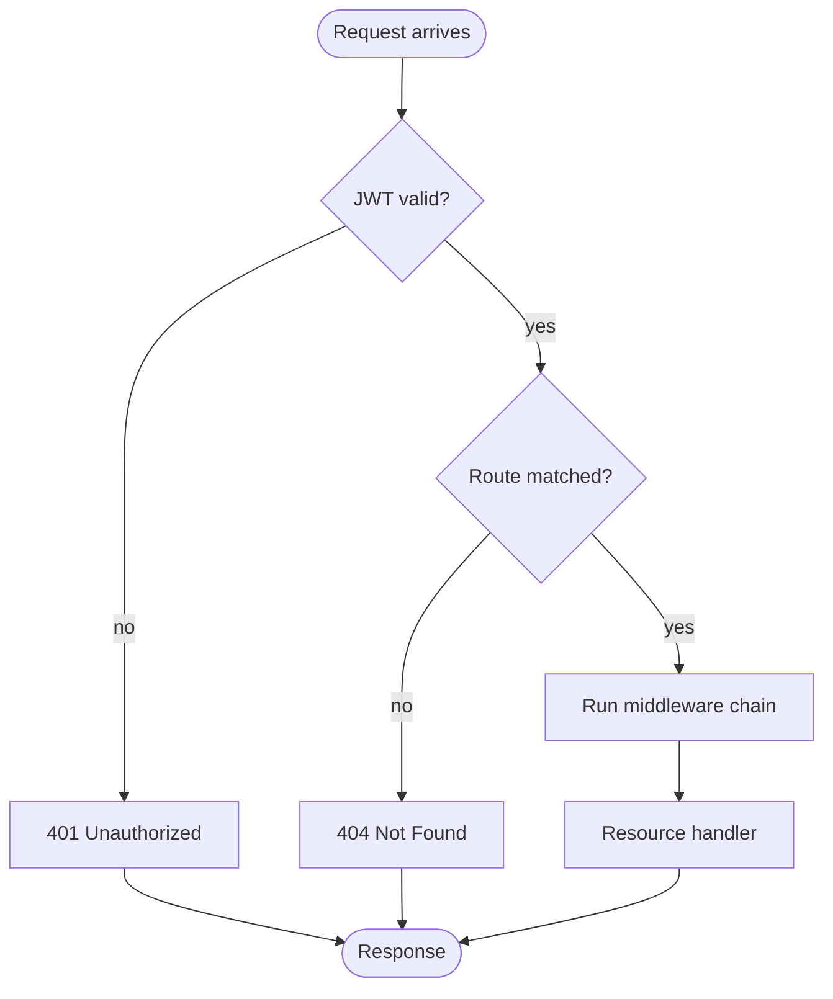
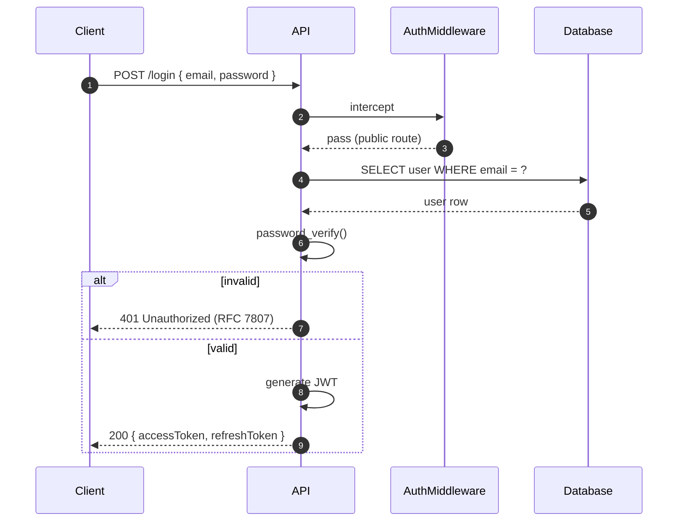
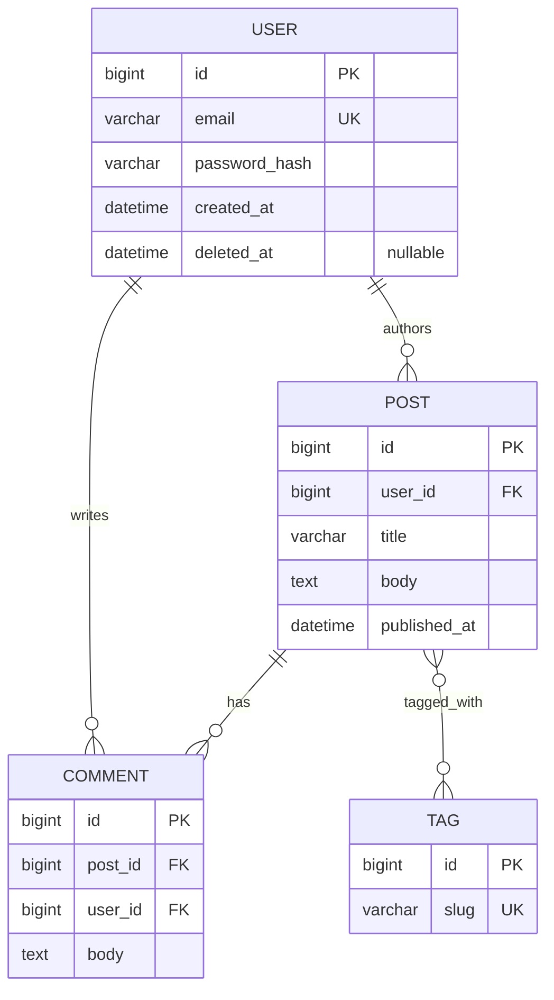
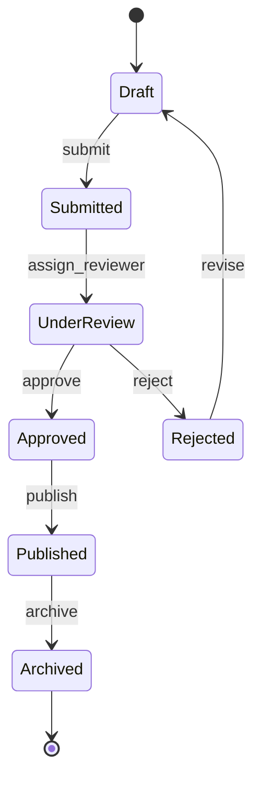
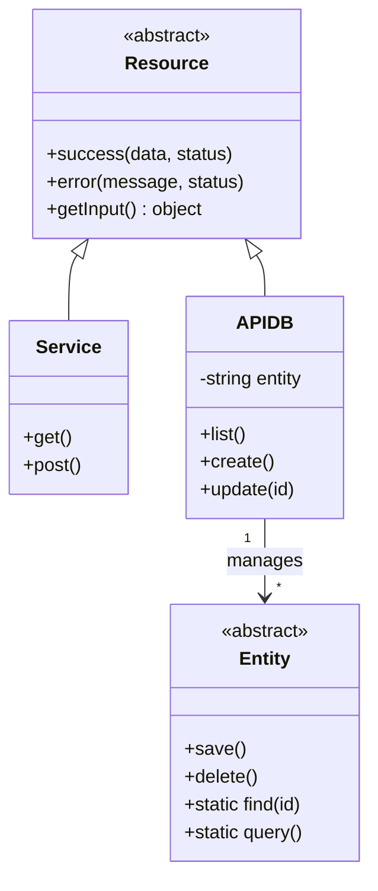
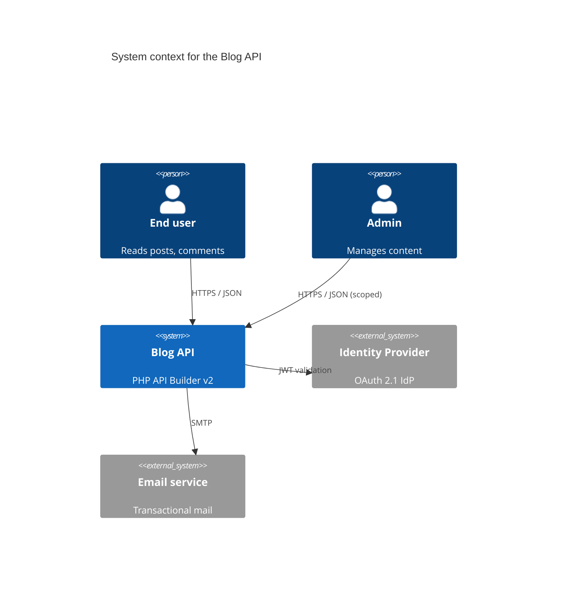

# Diagrams as Code — Mermaid-first

Diagrams that live next to the code they describe, render without plugins, and survive refactors. Everything here is Mermaid unless explicitly stated.

## Non-negotiable rules

1. **Diagrams live in markdown files**, embedded in fenced code blocks with the ` ```mermaid ` tag. No PNG/SVG dumped into `resources/` unless a diagram fundamentally can't be expressed in Mermaid.
2. **One diagram per decision**, not per page. A README with 8 diagrams is worse than a README with 2 sharp ones.
3. **Diagrams are reviewed like code.** They go through PRs. Outdated diagrams are deleted — not updated half-heartedly.
4. **Every diagram has a caption** explaining what it shows and why it matters. Diagrams without context are noise.

## When to use which diagram

| Situation | Diagram |
|---|---|
| A user/request walks through N steps with decisions | `flowchart` |
| Two or more components exchange messages over time | `sequenceDiagram` |
| Data model: tables/entities and their relationships | `erDiagram` |
| Object has discrete states and transitions between them | `stateDiagram-v2` |
| Show class hierarchy, interfaces, inheritance | `classDiagram` |
| Overview of system boundaries / containers / components | `C4Context` / `C4Container` / `C4Component` |
| Time on X, events on lanes | `gantt` (only for roadmaps, rare) |
| Tree of decisions without side effects | `mindmap` (for exploratory brainstorms, never in formal docs) |

If you can't fit your idea into one of these, split it into two diagrams. Resist the urge to invent a hybrid.

## Flowchart — the workhorse



Direction: `TD` (top-down) for processes, `LR` (left-right) when there's many parallel paths. Shapes carry meaning:

- `([Start/End])` — terminators
- `[Rectangle]` — process/step
- `{Diamond}` — decision
- `[(Database)]` — data store
- `[[Subroutine]]` — reusable subprocess
- `>Output]` — I/O

Keep node labels terse (2–5 words). Move details to the caption.

## Sequence diagram — interactions over time



- `autonumber` makes step references stable in prose.
- `->>` solid arrow for synchronous call, `-->>` dashed for response.
- `alt`/`else`/`end` for branching. `opt` for optional. `loop` for repetition.
- Keep participants ≤ 5. If you need more, the interaction is too big — split it.

## ER diagram — data model



Cardinality notation:
- `||--||` one-to-one
- `||--o{` one-to-many (zero or many on the right)
- `||--|{` one-to-many (one or many on the right)
- `}o--o{` many-to-many

Mark keys: `PK`, `FK`, `UK` (unique). Use `"nullable"` as a column comment when it matters.

## State diagram — state machines



- `[*]` is the implicit start/end.
- Label transitions with the event that triggers them.
- If a state has sub-states, nest them:
  ```
  state UnderReview {
      [*] --> PeerReview
      PeerReview --> FinalReview
      FinalReview --> [*]
  }
  ```
- If the diagram has more than ~10 states, it's likely two state machines. Split.

## Class diagram — design documentation



Use class diagrams sparingly — they go stale fast. Prefer ER for persistence and sequence for interaction.

Relationships: `<|--` inheritance, `*--` composition, `o--` aggregation, `-->` association, `..>` dependency.

## C4 model — architecture at 3 zoom levels



C4 has 4 levels; in practice you only ever need the first 2 or 3:
- **Context**: system + external actors. One diagram per system.
- **Container**: deployable units (API, DB, cache, worker). One diagram per system.
- **Component**: inside a container, the main components. One diagram per container.
- **Code**: class/file level. Use class diagrams instead; C4 Code is rarely worth it.

Mermaid supports `C4Context`, `C4Container`, `C4Component`, `C4Dynamic`, `C4Deployment`.

## Captions — the rule

Every diagram gets a caption below it (or inline in the doc):

> **Figure 2 — Authentication flow.** A login request bypasses `AuthMiddleware` (public route), then verifies credentials and issues a JWT access+refresh token pair. See `src/Auth/` for implementation.

What makes a good caption:
- States what the diagram shows (one sentence).
- Points to the code/file where the behavior lives.
- Mentions the specific decision or invariant being illustrated.

## Where diagrams live in this repo

```
resources/docs/
├── 01-analisis-y-diseno.md         # high-level design — embeds C4 + ER
└── diagrams/
    ├── request-lifecycle.md         # sequence
    ├── entity-model.md              # ER
    ├── state-machine-order.md       # stateDiagram
    └── architecture-context.md      # C4
```

Each diagram file is short (one diagram + caption + context) and is linked from the main design doc. The README only embeds diagrams when they're essential to the first-impression pitch.

## Style conventions

- Node labels: Title Case or sentence case, be consistent within a diagram.
- Edge labels: lowercase verb phrases — "sends", "returns", "on error".
- Keep diagrams monochrome unless color carries meaning. If you add color, use 2–3 accent colors max.
- No emoji in nodes — they render inconsistently across viewers.
- No ASCII-art fallbacks. Mermaid or nothing.

## Common anti-patterns to avoid

- **The mega-diagram**: 40 nodes, every possible branch, impossible to read. Fix: abstract, split, or simplify.
- **The stale diagram**: labeled for a feature that no longer exists. Fix: diff-review every PR; update or delete.
- **The decorative diagram**: illustrates nothing a reader couldn't grasp from prose. Fix: delete.
- **The duplicate diagram**: same content expressed three ways. Fix: one canonical diagram.
- **Putting diagrams in PNG**: version control can't diff them, and they break when the underlying reality changes. Fix: Mermaid everywhere possible.

## Triggers for the documenter

When updating docs, generate or update a diagram if the change:
- **Adds/changes a request flow** → sequence diagram.
- **Adds/modifies an entity relationship** → update the ER diagram.
- **Introduces a state machine** (order statuses, subscription stages, approval workflows) → state diagram.
- **Adds a new middleware or changes the middleware chain** → flowchart of the request lifecycle.
- **Changes the high-level architecture** (new service, new external dep) → update the C4 Context or Container diagram.

Don't add diagrams for trivial changes. A validator fix doesn't need a diagram.

## Quick Mermaid cheat sheet

| Syntax | Purpose |
|---|---|
| `flowchart TD` | Top-down flowchart |
| `flowchart LR` | Left-right flowchart |
| `sequenceDiagram` | Interactions over time |
| `erDiagram` | Entity-relationship |
| `stateDiagram-v2` | State machine |
| `classDiagram` | Object-oriented design |
| `C4Context` / `C4Container` | Architecture |
| `gitGraph` | Git branching scenarios (rare) |

## References

- For patterns Mermaid can't express cleanly (complex UML activity, deployment topologies), see `references/plantuml-advanced.md`.
- For C4 methodology rationale, see https://c4model.com/.

## Checklist before finishing a diagram

- [ ] Right type for the idea (flow/sequence/ER/state/class/C4).
- [ ] Fits on one screen at normal zoom.
- [ ] Labels are concise.
- [ ] Has a caption.
- [ ] Linked from the relevant prose.
- [ ] Renders correctly (mermaid.live is a quick preview).
- [ ] Under `resources/docs/diagrams/` or embedded in the doc it illustrates.
- [ ] Old/stale version removed if this one replaces it.
