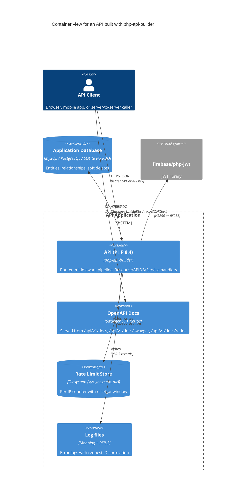

# Architecture — Container View

**Figure 1 — Container view.** An API built on `php-api-builder` is a single PHP process that routes requests through a middleware pipeline to Entity-backed or custom handlers. Auth is handled in-process via `firebase/php-jwt`; rate-limit counters persist to disk under the system temp directory; Monolog writes logs with a per-request `X-Request-ID`. The OpenAPI docs endpoints (Swagger UI, ReDoc, raw spec) are served by `DocsController` and discovered at runtime from `entities/` and `services/`. See `src/API.php`, `src/Router.php`, and `src/Http/Middleware/`.
