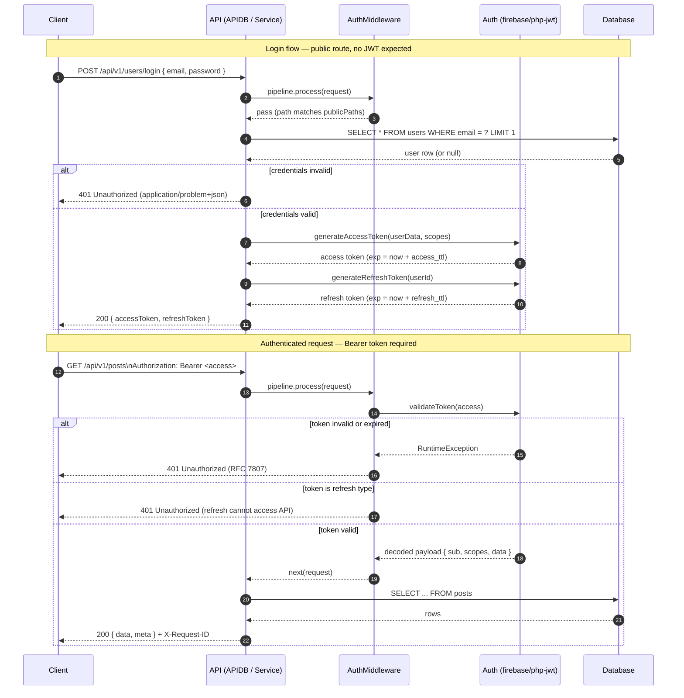

# Authentication — Login and Authenticated Request

**Figure 3 — Login and authenticated request.** Login endpoints are exempted by registering their path in `AuthMiddleware`'s `publicPaths`. On success the library issues a short-lived access token (default 15 minutes, `access_ttl`) and a longer refresh token (default 7 days, `refresh_ttl`) signed with the configured algorithm — HS256 by default, RS256/ES* if `private_key`/`public_key` are supplied. Every non-public request must present the access token as `Authorization: Bearer <jwt>`; refresh tokens are explicitly rejected for API access. See `src/Auth/Auth.php` and `src/Http/Middleware/AuthMiddleware.php`.
