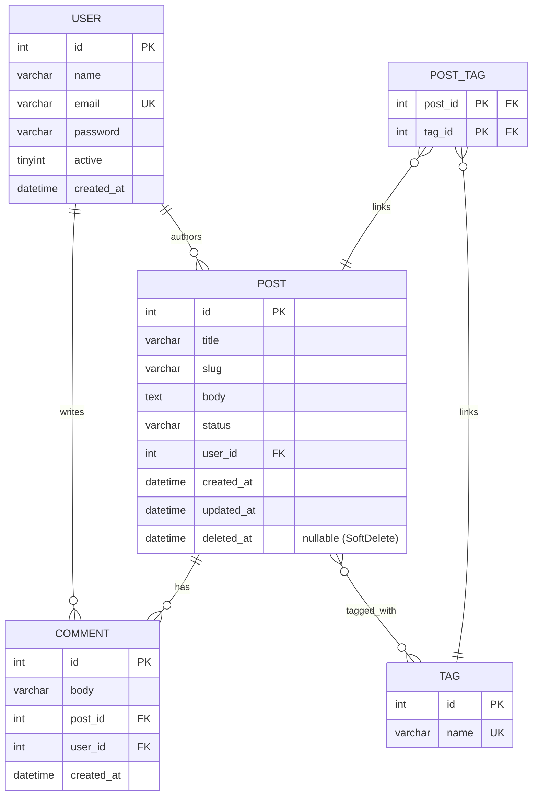

# Entity Model — Illustrative Example (Blog Demo)

**Figure 4 — Illustrative entity model.** This is the schema shipped with `./api demo:install` (Blog API demo), not a schema the library itself requires — `php-api-builder` has no fixed data model. It shows the three relationship attributes the ORM supports: `#[BelongsTo]` (Post → User, Comment → Post, Comment → User), `#[HasMany]` (User → Posts, Post → Comments), and `#[BelongsToMany]` (Post ↔ Tag via the `post_tags` pivot). `POST.deleted_at` marks the `#[SoftDelete]` convention — soft-deleted rows are filtered out of queries by `Entity::find()` and `Entity::all()`. See `resources/demo/schema.sql` and `resources/demo/entities/`.
