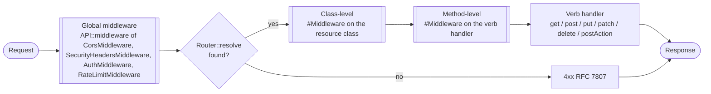

# Middleware Pipeline — Layered Dispatch



**Figure — Four-layer middleware pipeline.** Middlewares run in this fixed outer-to-inner order on every matched request:

1. **Globals** registered via `API::middleware([...])` — typically CORS, security headers, auth, rate limit. Same stack for every endpoint, configured once at application boot.
2. **Class-level** `#[Middleware]` attributes declared on the `Resource`, `Service`, or `APIDB` subclass. Applied to every verb handler in that class.
3. **Method-level** `#[Middleware]` attributes declared on the specific handler (`get`, `post`, `postLogin`, etc.). Applied only when that verb is dispatched.
4. **Handler** — the verb method itself produces the `Response`.

`#[Middleware]` is `IS_REPEATABLE`: the same target (class or method) may stack several attributes, and they run in declaration order within that target. Named arguments on the attribute are forwarded to the middleware constructor as-is:

```php
#[Middleware(RateLimitMiddleware::class, limit: 10, windowSeconds: 60)]
public function get(): void { /* ... */ }
```

`MiddlewareResolver` validates at dispatch time that the declared class implements `MiddlewareInterface`; a mismatch raises `RuntimeException` instead of silently dropping the declaration (the bug tracked as issue #3). See `src/Http/Middleware/MiddlewareResolver.php` and `src/API.php::runThroughRouteMiddlewares()`.
