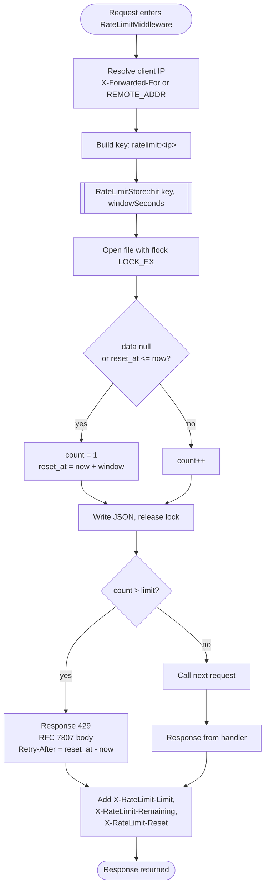

# Rate Limit Flow

**Figure 5 — Rate limit flow.** The middleware keys counters by client IP (honouring the first `X-Forwarded-For` hop when present) and persists them to `sys_get_temp_dir() . '/php-api-builder-ratelimit'` with an exclusive file lock, so the mechanism works without Redis or Memcached. Limits default to 60 requests per 60 seconds and are configurable via `RATE_LIMIT_MAX` and `RATE_LIMIT_WINDOW` in `.env`. Every response — allowed or blocked — carries the standard `X-RateLimit-*` headers, and 429 responses add `Retry-After` with the remaining seconds in the window. See `src/Http/Middleware/RateLimitMiddleware.php` and `src/Http/Middleware/RateLimitStore.php`.
