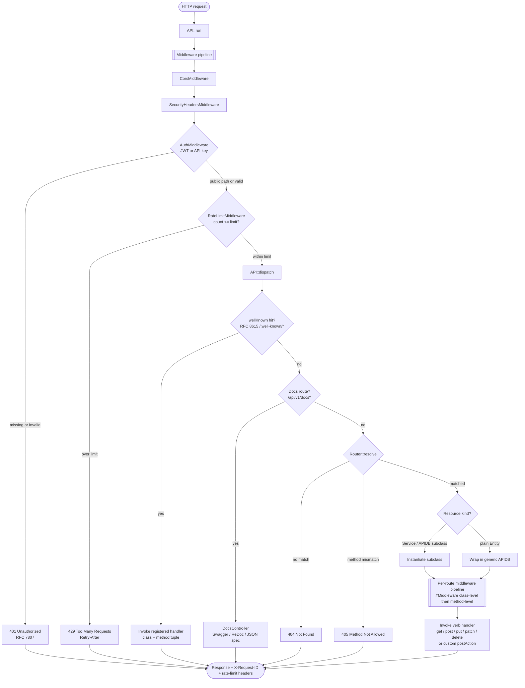

# Request Lifecycle

**Figure 2 — Request lifecycle.** Every request passes through the middleware pipeline registered on `API::middleware()` before the router matches a resource. The default order is CORS → security headers → auth → rate limit, but the order is whatever the application registers. Inside `API::dispatch()` the well-known lookup runs first: if the request path matches an entry registered via the `wellKnown` constructor argument (RFC 8615 discovery endpoints — JWKS, OpenID Connect configuration, security.txt, etc.), the registered `[class, method]` handler is invoked directly, bypassing the `apiPrefix` router. Otherwise the docs route is checked, and finally `Router::resolve()` maps kebab-case URL segments to PascalCase class names in the application namespace; a bare `Entity` subclass is wrapped at runtime in a generic `APIDB` to expose standard CRUD verbs. After the handler is resolved, `MiddlewareResolver` reads `#[Middleware]` attributes from the resource class and the matched method and runs them (in that order) before the verb handler executes; see `diagrams/middleware-pipeline.md` for the layered detail. Error branches return RFC 7807 problem responses. See `src/API.php::run()`, `src/API.php::dispatch()`, `src/API.php::handleWellKnown()`, `src/Http/Middleware/MiddlewareResolver.php`, and `src/Http/Middleware/MiddlewarePipeline.php`.
